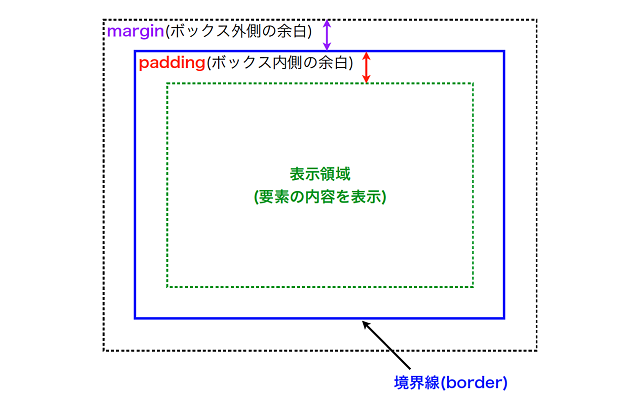
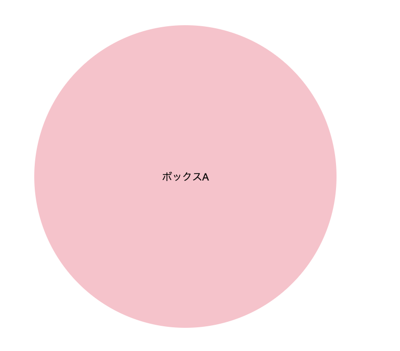
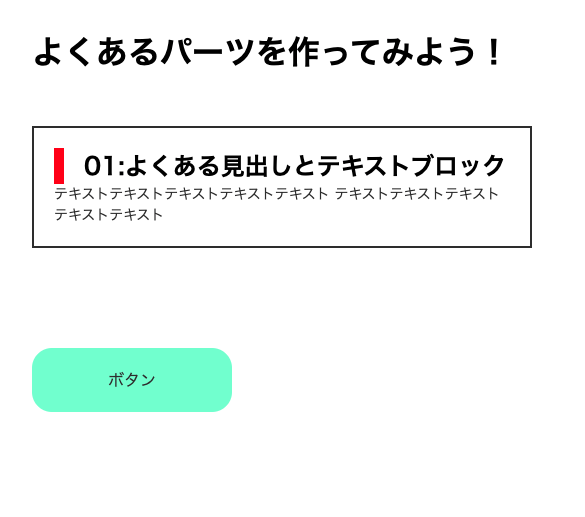
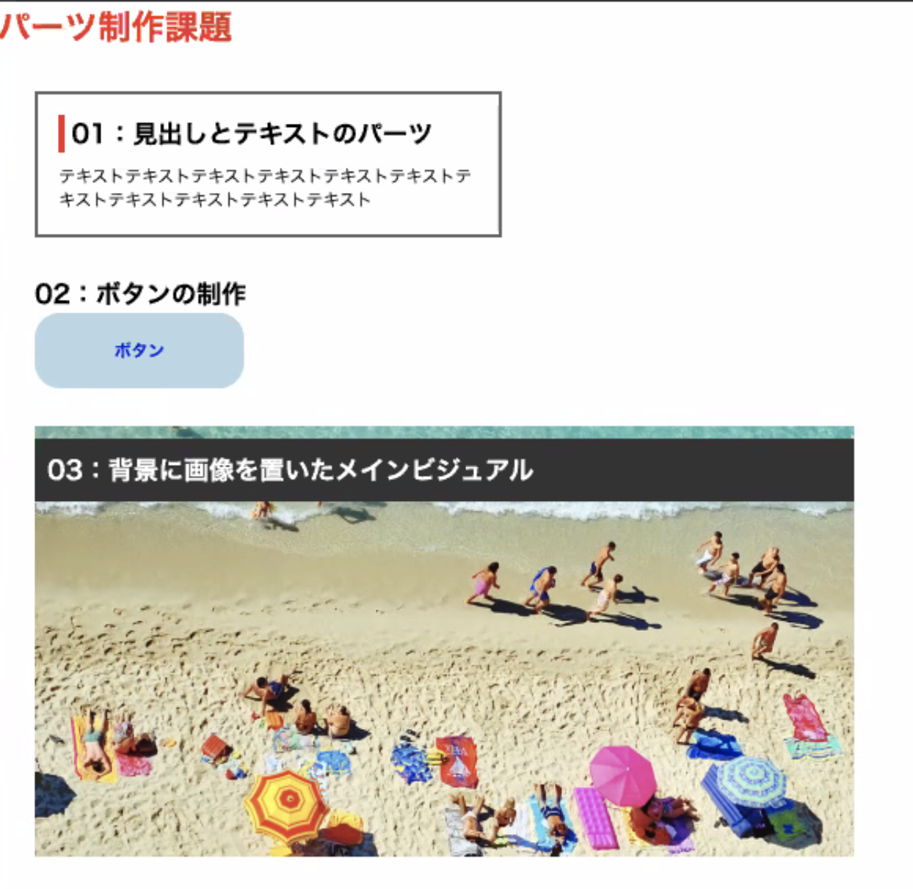

# 03:CSS（基本、装飾編）
## CSS（Cascading Style Sheets） 
HTMLと同様にWeb制作の中で用いられる言語の一つがこのCSS(Cascading Style Sheets)です。 <br>
HTMLに「文書を作成する」という役割があったように、 <br>
CSSには「装飾（デザイン）の指定をする」という役割が存在します。 <br>
<br>
HTMLとCSSをリンクさせることによって、CSSの指示内容がHTMLに反映されます。 <br>
Web言語は言語ごとに役割があり、いくつかの言語を組み合わせてWebページを作るのが一般的な制作手法となります。 <br>

## セレクタ、プロパティ、値

```

h1{
    color:red;
}

セレクタ { 
    プロパティ: 値；
}

どこの { 
    なにを : どうする；
}

```

### CSSファイルのリンク方法
使用するHTMLファイルからCSSファイルまでのパスを記述して読み込みます。
```
<link rel="stylesheet" href="css/style.css">
```

## セレクタについて（CSSを設定する要素の取得方法）

### ユニバーサルセレクタ
全ての要素に対して、装飾がかかります。
```
*{
  margin:0px;
  padding:0px;
}
```

### 子孫セレクタ
こちらの例だと、sectionタグの中のpタグに装飾がかかります。
```
section p{
  color:limegreen;
}
```

### IDセレクタ
こちらの例だと、idがtargetのタグに装飾がかかります。<br>
```
<p id="target">ここに文章</p>

#target{
  background-color:skyblue;
}
```

### classセレクタ
こちらの例だと、classがstrongのタグに装飾がかかります。<br>
```
<p class="strong">ここに文章</p>

.strong{
    color:pink;
    font-size:36px;
    font-weight:bold;
}

.line{
    text-decoration:underline;
}

/* 数字始まりはダメ */
/* 2個以上、指定可能 */
<p class="strong line">ライン</p>
```

### リンク擬似クラス
hover状態の時などの少し特殊な指定方法です。
```
ul li a:hover{
  color:pink;
  font-size:36px;
}

参考:[CSS] 疑似クラス一覧
https://pasomaki.com/css-pseudo_class/
```


<!--
# セレクタと獲得ポイント (classよりidが優先される)
CSSでセレクタ を指定する際、指定したセレクタ に獲得ポイントというものが与えられます。特に表示に影響するものではなく、CSSの優先順位を決定づけるものになります。

```
以下セレクタ の種類毎の獲得ポイントです。

ユニバーサルセレクタ ：0ポイント
要素名セレクタ ：1ポイント
擬似要素：1ポイント　※「要素名::before」や「要素名::after」など
class名セレクタ ：10ポイント
id名セレクタ ：100ポイント

上の考え方で計算をするため、例えばid名testというp要素に命令を出すと以下のようになります。

P { color：#000 }・・・1ポイント
#test { color：#f00 }・・・100ポイント

同じ要素に異なるセレクタ で命令を出していますが、よりポイントの高いid名セレクタ の指定が優先されます。
```
-->
<!--
デベロッパーツールの使い方<br>
https://saruwakakun.com/html-css/basic/chrome-dev-tool
-->

<!--
# ボックスモデル
```
<h1>ボックスモデルについて</h1>
<section>
    <div class=“boxA”>ボックスA</div>
    <div class=“boxB”>ボックスB</div>
</section>


.boxA{
  background-color:tomato;
  width:200px;
  height:200px;
  padding:20px; /* 内側の余白詰め物*/
  border:10px;
  margin-bottom:40px; /* 強い方が勝つ */
}

.boxB{
  width:200px;
  height:200px;
  padding:20px;
  box-sizing:border-box;
  background-color:skyblue;
}
```

-->
# marginとpaddingについて
全ての要素は表示領域とその境界線、余白があり、この3つを合わせた領域のことをボックスと呼びます。<br>
内側と外側は余白をとることができ、ボーダー内側の余白をpadding、外側の余白をmarginと呼びます。<br>




```
<h1>marginとpaddingについて</h1>
<section>
    <div class=“boxA”>ボックスA</div>
    <div class=“boxB”>ボックスB</div>
</section>

```

```
.boxA{
  width:200px;
  height:200px;
  padding:20px;
  background-color:skyblue;
}

.boxB{
  width:200px;
  height:200px;
  margin:20px;
  background-color:red;
}

```

### 角丸の表現
ブロック要素の角を丸くすることができます。 
正円の半径の大きさを使って、円弧をベースにした角丸を実装できます。 <br>
参考：https://www.webcreatorbox.com/tech/border-radius



```


以下のように書くことで、4角の角丸のサイズを一括で設定ができます。 
border-radius:サイズ;

/* border-radius: 30px; */
border-radius: 50%;   など


.boxA {
    background-color: pink;
    width: 300px;
    height: 300px;
    border-radius: 50%;
    text-align: center;
    line-height: 300px;
}

    

以下のプロパティ名で四隅の角丸の大きさをそれぞれ個別に設定することも可能です。

border-top-left-radius
border-top-right-radius
border-bottom-right-radius
border-bottom-left-radius

```


# 背景画像(background-image)の表示方法（よく使います！）

html
```
<!DOCTYPE html>
<html lang="en">
<head>
    <meta charset="UTF-8">
    <meta name="viewport" content="width=device-width, initial-scale=1.0">
    <title>Document</title>
    
    <!-- ここ！ -->
    <link rel="stylesheet" href="css/style.css">
    
</head>
<body>
    
</body>
</html>
```

css
```
*{
    padding: 0;
    margin: 0;
}
h1{
    color:red;
    width:100%;
    height:100vh;
}

header{
    background-color:pink;
    width:100%; /*親要素に対して*/
    width: 100vw;   /*vw デバイスサイズに対して*/
    height: 100vh;    
    background-image:url(../images/sora.jpg);
    background-size: cover;
    background-repeat: no-repeat;
}

```


# リセットCSS（ブラウザの初期cssをリセット）
リセットCSSとは、ブラウザによって異なるデフォルトのCSSを打ち消して、<br>
ブラウザ間の表示を揃えるためのCSSのことをいいます。
```
/* 簡易リセットcss */
*{
  margin:0px;
  padding:0px;
  box-sizeing:border-box;
}
```
2020年リセットCSS <br>
https://webdesign-trends.net/entry/8137


## 練習問題(よくあるパーツを作ってみましょう！)




```
<!DOCTYPE html>
<html lang="en">
<head>
    <meta charset="UTF-8">
    <meta http-equiv="X-UA-Compatible" content="IE=edge">
    <meta name="viewport" content="width=device-width, initial-scale=1.0">
    <link rel="stylesheet" href="css/style.css">
    <title>Document</title>
</head>
<body>

    <h1>よくあるパーツを作ってみよう！</h1>

    <div id="box1">
        <h2>01:よくある見出しとテキストブロック</h2>
        <p>テキストテキストテキストテキストテキスト
            テキストテキストテキストテキストテキスト
        </p>
    </div>


    <a id="btn" href="#">ボタン</a>
    
</body>
</html>

```

```

/* リセットcss */

*{
    margin: 0;
    padding: 0;
    box-sizing: border-box;
}

body{
    padding: 50px;
}

h1{
    margin-bottom: 50px;
}


/* 問い1 */
#box1{
    width: 500px;
    padding: 20px;
    border: 2px solid #333;
    margin-bottom: 100px;
}

#box1 h2{
    border-left: 10px solid red;
    padding-left: 20px;
}

#box1 p{
    color: #333;
    font-size: 14px;
    line-height: 1.5;
}


/* 遠いに*/

#btn{
    display: block;
    width: 200px;
    padding: 20px;
    background:aquamarine;
    color: #333;
    border-radius: 20px;
    text-align: center;
    text-decoration: none;
}


```


<!--
## 練習問題(よくあるパーツを作ってみましょう！)



html
```

<!DOCTYPE html>
<html lang="ja">
<head>
    <meta charset="UTF-8">
    <meta name="viewport" content="width=device-width, initial-scale=1.0">
    <title>パーツ制作課題</title>
    <link rel="stylesheet" href="css/sample.css">
</head>
<body>
    <h1>パーツ制作課題</h1>

    <section id="koumoku01" class="parts01">
        <h2>01：見出しとテキストのパーツ</h2>
        <p>テキストテキストテキストテキストテキストテキストテキストテキストテキストテキストテキスト</p>
    </section>

    <section id="koumoku02" class="parts02">
        <h2>02：ボタンの制作</h2>
        <p><a href="">ボタン</a></p>

    </section>

    <section id="koumoku03" class="parts03">
        <h2>03：背景に画像を置いたメインビジュアル</h2>
    </section>
    
</body>
</html>
```

css
```
* {
    margin: 0;
    padding: 0;
}

h1 {
    color: #f00;
}

section {
    margin: 40px;
}

.parts01 {
    border: solid 4px #444 ;
    width: 500px;
    padding: 20px;
    box-sizing: border-box;
}

.parts01 h2 {
    border-left: solid 8px #f00 ;
    padding-left: 12px;
    margin-bottom: 12px;
}

.parts02 p a {
    background-color: skyblue;
    display: block;
    width: 140px;
    height: 40px;
    text-align: center;
    line-height: 40px;
    text-decoration: none;
    color: #00f;
    border-radius: 20px;
    transition: 1s;
}

.parts02 p a:hover {
    background-color: pink;
    color: #f00;
}

.parts03 {
    background-color: #ccc;
    width: 500px;
    height: 300px;
    padding-top: 12px;
    background-image: url(../images/sora.jpg);
    background-repeat: no-repeat;
    background-size: cover;
    background-position: center;
}

.parts03 h2 {
    /* background-color: #444; */
    background-color: rgba(0,0,0, 0.5);
    color: #fff;
}
```
-->
